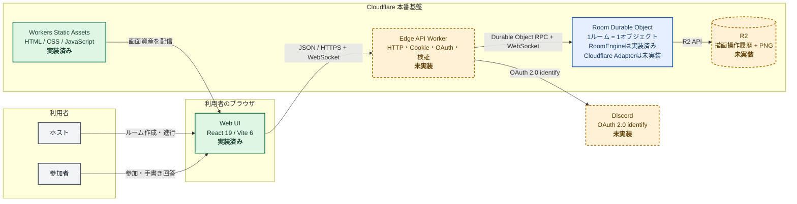

# WebFlipper 1ページ構成概要

Acceptedな本番目標構成と、現在の実装状況を1枚で示す。詳細な責務は各C4図を参照する。

```mermaid
flowchart LR
  subgraph people[利用者]
    host[ホスト]
    participant[参加者]
  end

  subgraph client[利用者のブラウザ]
    spa["Web UI<br/>React 19 / Vite 6<br/><b>実装済み</b>"]
  end

  subgraph cloudflare[Cloudflare 本番基盤]
    assets["Workers Static Assets<br/>HTML / CSS / JavaScript<br/><b>実装済み</b>"]
    worker["Edge API Worker<br/>HTTP・Cookie・OAuth・検証<br/><b>未実装</b>"]
    room["Room Durable Object<br/>1ルーム = 1オブジェクト<br/>RoomEngineは実装済み<br/>Cloudflare Adapterは未実装"]
    r2[("R2<br/>描画操作履歴 + PNG<br/><b>未実装</b>")]
  end

  discord["Discord<br/>OAuth 2.0 identify<br/><b>未実装</b>"]

  host -->|ルーム作成・進行| spa
  participant -->|参加・手書き回答| spa
  assets -->|画面資産を配信| spa
  spa -->|JSON / HTTPS + WebSocket| worker
  worker -->|Durable Object RPC + WebSocket| room
  room -->|R2 API| r2
  worker -->|OAuth 2.0 identify| discord

  classDef implemented fill:#dff6e5,stroke:#26734d,color:#153c2b,stroke-width:2px;
  classDef planned fill:#fff1d6,stroke:#aa6b00,color:#5b3b00,stroke-width:2px,stroke-dasharray:5 4;
  classDef partial fill:#e5efff,stroke:#245ea8,color:#15385f,stroke-width:2px;
  classDef actor fill:#f3f4f6,stroke:#4b5563,color:#111827,stroke-width:2px;

  class host,participant actor;
  class spa,assets implemented;
  class room partial;
  class worker,r2,discord planned;
```

## 凡例

- 緑: 現在のリポジトリに実装済み
- 青: 中核Moduleは実装済みだが、本番Adapterは未実装
- 黄の破線: ADRで採用済みの目標構成、未実装

